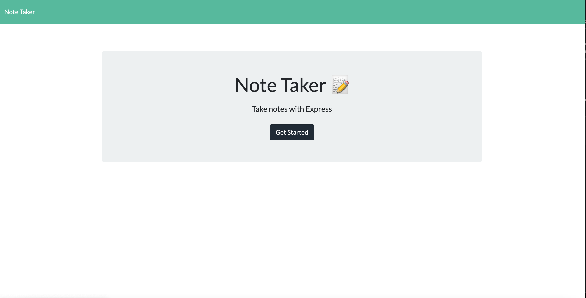

# Note Taker

Note Takes is an web application that will let the user save notes and save them.

## Website image


## Installation

Head over to my gitHUb repository  [repo](https://github.com/cesarrr93/noteTaker) to install Note Taker. Clone the files and do a npm i in you terminal make sure you are inside the file. 

```bash
npm i 
npm install express
```

## Usage

```python
npm start
```

## License
[MIT](https://choosealicense.com/licenses/mit/)